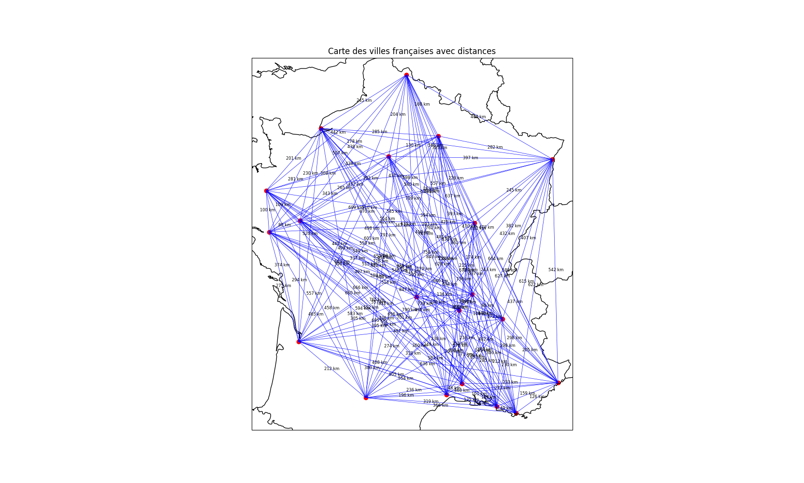
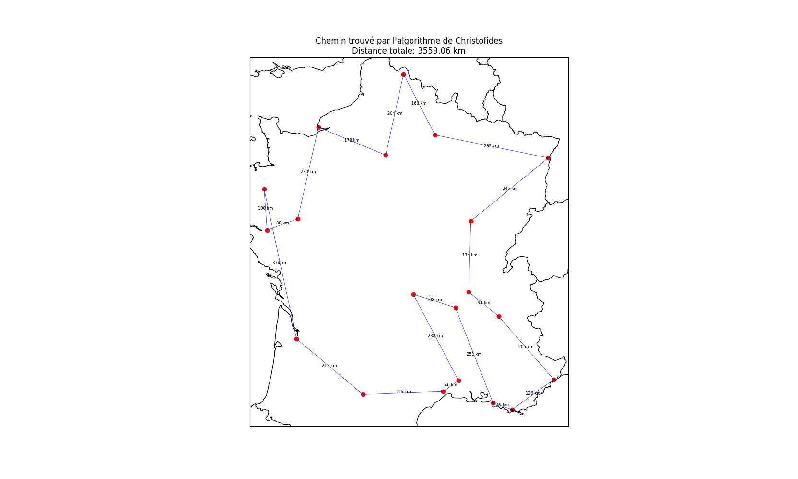

# travelling-merchant

## 1. Introduction  
Ce projet nous plonge dans l'un des problèmes classiques de l'optimisation : le problème du Voyageur de Commerce (TSP). À travers sa résolution, nous serons amenés à développer des compétences variées en algorithmique, mathématiques appliquées et programmation. Plus précisément, ce projet mettra en lumière des méthodes pour résoudre des problèmes NP-difficiles, qui nécessitent souvent l'emploi d'approches heuristiques ou approximatives, en raison de la complexité croissante des solutions exactes.

Au-delà de la simple implémentation algorithmique, la résolution du TSP dans un contexte pratique nous permettra de manipuler des concepts d'algorithmes combinatoires, comme l'algorithme de Christofides, tout en explorant des approches évolutives comme les algorithmes génétiques. Ce projet favorisera ainsi une approche rigoureuse et scientifique de la résolution de problèmes, tout en développant des compétences en analyse de performance et en comparaison des solutions proposées.

En outre, ce projet constituera une expérience enrichissante pour quiconque cherche à maîtriser des outils fondamentaux dans le domaine de l'optimisation et de la recherche opérationnelle, des compétences particulièrement recherchées dans le monde de la data science et de l’intelligence artificielle.

## 2. Présentation du projet
_Description du projet:_  

"Dans la France médiévale, les routes sinueuses et dangereuses, les forêts épaisses, et les montagnes escarpées constituaient des défis quotidiens pour les voyageurs. Les marchands ambulants jouaient un rôle crucial dans l'économie en transportant des marchandises (souvent) rares et précieuses d'une contrée à l'autre. Ces marchands devaient parcourir de
longues distances pour vendre leurs biens dans différents marchés et foires.  

Théobald est un marchand expérimenté dont le succès dépend de sa capacité à planifier efficacement ses voyages pour maximiser ses profits et minimiser les risques inhérents à chaque trajet. En effet, chaque détour inutile ou route imprévue peut entraîner des coûts supplémentaires, des retards, et une exposition accrue aux dangers comme les bandits et les conditions météorologiques imprévisibles. C'est ici qu'intervient le Problème du Voyageur de Commerce (TSP), un défi mathématique et algorithmique consistant à trouver le chemin le plus court permettant de visiter un ensemble donné de villes une seule fois avant de revenir au point de départ. Dans le contexte de Théobald, la résolution optimale de ce problème est cruciale pour la viabilité économique de ses voyages. Le TSP est reconnu comme un problème NP-difficile, ce qui signifie qu'il n'existe pas de solution efficace connue pour toutes les instances du problème.  

Malgré cela, diverses méthodes et heuristiques permettent de trouver des solutions approximatives ou exactes dans des délais raisonnables. Toujours désireux d’aider votre prochain, vous prenez pitié de votre marchand ambulant préféré et vous lui donnez la chance de voyager sur des sentiers sécurisés. Votre objectif est d’identifier le chemin le plus court parmi les (n-1)! chemins possibles (où n est le nombre de villes à visiter) et ça bien sûr sans tous les évaluer !"  

_Réalisation du projet_  
Pour ce projet nous avons travaillé à trois en suivant le plan suivant: 
- 1) Modélisation du problème
- 2) Résolution avec l'algorithme de Christofides
- 3) Résolution avec les algorithmes génétiques
- 4) Analyse comparative

- 5) Conclusion  

C'est ce même plan que vous retrouverez dans ce Readme.  
Chacun d'entre nous avait une tâche à réaliser et nous nous sommes servis de Github pour le versionning de notre projet.  

_Architecture du projet:_  
Dans ce repository Github vous retrouverez trois fichiers pythons: 
- christofides.py dans lequel vous retrouverez la logique qui implémente l'algorithme de Christofides  
- genetic.py dans lequel vous retrouverez la logique qui implémente des algorithmes génétiques  
- main.py qui est notre point d'entrée et d'exécution de nos scripts.  

## 3. Algorithme de Christofides
### 3.1 Introduction  
L'algorithme de Christofides est une méthode d'approximation efficace pour résoudre le problème du voyageur de commerce (TSP), notamment dans des cas où obtenir une solution exacte serait trop coûteux en termes de calcul. Cet algorithme garantit une solution approchée dont la longueur ne dépasse jamais 1,5 fois la longueur de la solution optimale. Il est particulièrement adapté dans le cadre du TSP, car il permet de trouver un itinéraire court tout en optimisant le temps de calcul, ce qui le rend pertinent pour le projet de cartographie des villes.  

### 3.2 Étapes de l'algorithme  

_a) Génération du graphe complet_  
L'algorithme commence par la création d'un graphe complet. Chaque ville est représentée par un sommet et chaque paire de villes est reliée par une arête pondérée selon la distance qui les sépare.
Cette étape établit la base de travail pour la suite de l'algorithme.  

_b) Calcul du Minimum Spanning Tree (MST)_  
Ensuite, un arbre couvrant minimum (MST) est calculé à partir du graphe complet. Cet arbre est un sous-ensemble d'arêtes connectant tous les sommets du graphe sans former de cycles, et minimise la somme totale des distances des arêtes.
Le MST est utilisé comme une première approximation de l'itinéraire optimal, car il connecte toutes les villes avec le coût minimal.  

_c) Identification des sommets de degré impair_  
Après la construction du MST, les sommets ayant un degré impair (nombre impair de connexions) sont identifiés. Ces sommets doivent être appariés pour que le graphe puisse être transformé en un circuit Eulerien dans la prochaine étape.  

_d) Appariement des sommets impairs_  
Les sommets impairs identifiés sont appariés par un algorithme de couplage parfait, en minimisant la somme des distances des arêtes entre eux. Cet appariement permet de rétablir un degré pair pour tous les sommets concernés, ce qui est nécessaire pour construire un circuit Eulerien.  

_e) Construction du circuit Eulerien_  
Une fois les sommets impairs appariés, le graphe résultant permet de construire un circuit Eulerien. Un circuit Eulerien est un chemin qui passe par chaque arête du graphe exactement une fois.
Cette étape prépare l'algorithme à créer une approximation de la solution du TSP.  

_f) Approximation du circuit Hamiltonien_  
Le circuit Eulerien est ensuite transformé en circuit Hamiltonien, qui est un chemin passant par chaque sommet exactement une fois. Cela se fait en supprimant les doublons de sommets dans l’ordre de passage du circuit Eulerien.
Le résultat est une solution approchée du TSP.  

### 3.3 Pertinence de l'algorithme  

_a) Garantie d'approximation_  
L'algorithme de Christofides garantit que la longueur de la solution trouvée est au maximum 1,5 fois celle du chemin optimal. Cela permet d’obtenir une solution de qualité, proche de l'optimum, tout en évitant la complexité d'une solution exacte.  

_b) Efficacité computationnelle_  
Cet algorithme est plus rapide et plus efficace que les méthodes exactes du TSP, en particulier pour des problèmes de taille moyenne à grande. Cela le rend adapté aux situations où le calcul d'une solution optimale est trop coûteux.  

_c) Contexte de cartographie et d'itinéraires_  
Dans le cadre de la cartographie des villes pour Théobald, l'algorithme de Christofides fournit une solution quasi optimale permettant de minimiser les détours tout en réduisant les risques liés à des trajets prolongés. Il est particulièrement pertinent lorsqu'il s'agit de planifier des itinéraires en fonction des distances entre villes.  

### 3.4 Exécution & Résultats
Lors de l'exécution de l'algorithme, une liste des distances entre les 20 villes s'affiche dans le terminal. En suite, via Pyplot, une fenêtre s'ouvre avec les villes, les routes qui les relient et les distances qui sont placées sur la carte de France.  

  

Puis, en suivant les étapes vues dans la partie 3 de ce Readme, l'algorithme de Christofides est appliqué et une autre fenêtre Pyplot s'ouvre avec le meilleur itinéraires pour Théobald.  

  

### 3.5 Conclusion
L'algorithme de Christofides est une solution efficace et presque optimale pour résoudre le TSP dans un contexte de cartographie, où il est crucial de minimiser les distances parcourues tout en maintenant un temps de calcul raisonnable. Sa combinaison de précision et de rapidité en fait un choix pertinent pour des applications telles que la planification des itinéraires commerciaux de Théobald.  

## 4. Algorithme Génétique

L'algorithme génétique (AG) est une méthode inspirée de la nature, plus précisément de l'évolution. Il fonctionne un peu comme la sélection naturelle : on commence avec un ensemble de solutions (des itinéraires) et, au fil du temps, on garde les meilleures tout en les combinant et en les modifiant un peu pour améliorer les résultats. Cet algorithme est très utile pour résoudre des problèmes complexes comme le Problème du Voyageur de Commerce (TSP), surtout quand on ne peut pas calculer la solution exacte de manière rapide.

### 4.1 Introduction

Dans notre projet, on a utilisé un algorithme génétique pour résoudre le TSP. L'idée était de tester une approche qui simule l'évolution, où les itinéraires s'améliorent au fur et à mesure des générations. Même si on ne trouve pas toujours le chemin le plus optimal, l'algorithme génétique permet de s'en approcher, tout en étant assez flexible.

### 4.2 Détails de l'implémentation

Notre algorithme génétique fonctionne en plusieurs étapes :

- **Initialisation** : On commence par créer une population d'itinéraires aléatoires. Chaque itinéraire représente une façon de visiter toutes les villes. Plus la population est grande, plus on a de chances de trouver un bon itinéraire.
  
- **Évaluation** : Chaque itinéraire est évalué à l'aide d'une fonction appelée "fitness". Cette fonction est basée sur la distance totale : plus le chemin est court, plus la fitness est élevée. L'objectif est donc de maximiser cette fitness.

- **Sélection** : On sélectionne les itinéraires les plus performants pour les croiser entre eux. On utilise des techniques comme la roulette ou le tournoi pour choisir les meilleurs itinéraires, tout en gardant un peu de hasard pour éviter de rester bloqué sur une mauvaise solution.

- **Croisement** : Les itinéraires sélectionnés se croisent pour créer de nouveaux itinéraires. On a utilisé deux types de croisements : le croisement d'ordre (Order Crossover) et le PMX (Partially Mapped Crossover). Ces croisements permettent de combiner deux itinéraires et d'en créer un nouveau, qui espérons-le, sera meilleur.

- **Mutation** : Pour éviter que l'algorithme se retrouve coincé avec des itinéraires qui ne s'améliorent plus, on introduit de temps en temps des mutations. Cela consiste à échanger deux villes dans un itinéraire, histoire de garder un peu de diversité dans les solutions.

- **Itérations** : Ce processus de sélection, croisement et mutation est répété sur plusieurs générations. L'idée est d'améliorer les itinéraires au fil du temps jusqu'à ce qu'on arrive à un bon résultat ou qu'on atteigne un nombre maximum de générations.

### 4.3 Résultats et optimisation

L'un des avantages des algorithmes génétiques, c'est qu'ils sont très flexibles, mais ils peuvent aussi être imprévisibles. Dans notre projet, après plusieurs générations, l'algorithme génétique a trouvé des itinéraires assez bons, mais les résultats peuvent varier à chaque exécution, car il y a une part de hasard dans le processus. Contrairement à l'algorithme de Christofides, qui garantit une solution proche de l'optimum, les résultats de l'algorithme génétique dépendent des paramètres choisis (comme la taille de la population ou le taux de mutation).

Dans nos tests, l'algorithme génétique a produit des itinéraires de 5000 à 6300 km environ. Bien que ce soit un peu plus long que l'algorithme de Christofides, avec les bons réglages, il est possible de se rapprocher de la solution optimale.

### 4.4 Visualisation

Pour voir les résultats de manière plus concrète, nous avons utilisé **Cartopy** pour tracer les itinéraires sur une carte de la France. Chaque ville est représentée par un point rouge, et les itinéraires trouvés sont tracés entre elles. Les distances parcourues sont également affichées, ce qui nous permet de visualiser comment l'algorithme génétique optimise progressivement le trajet.

### Conclusion

L'algorithme génétique est une approche intéressante et flexible pour résoudre le TSP. Même s'il ne garantit pas toujours de trouver la meilleure solution possible, il permet d'explorer un grand nombre de solutions et de les améliorer génération après génération. En ajustant bien les paramètres, on peut obtenir des résultats très proches de l'optimum. Cela en fait une méthode puissante pour résoudre des problèmes complexes comme celui du voyageur de commerce.

## 5. Analyse comparative
L'analyse comparative des deux méthodes de résolution du TSP, l'algorithme de Christofides et les algorithmes génétiques, permet de mettre en lumière les forces et les faiblesses de chaque approche.

Les algorithmes génétiques sont des approches évolutives basées sur des concepts de sélection naturelle et de mutation. Ils permettent d'explorer un espace de solutions plus large et de trouver des solutions potentiellement meilleures que les méthodes déterministes. Les algorithmes génétiques sont particulièrement adaptés pour des problèmes complexes et non linéaires, où la recherche d'une solution optimale est difficile. Dans le contexte du TSP, les algorithmes génétiques offrent une approche flexible et robuste pour trouver des solutions de qualité, même si elles ne sont pas garanties d'être optimales.

L'algorithmes génétique donne une distance total de 5969.24 km.
Cette distance peut varier car les algorithmes génétiques sont stochastiques et peuvent donner des résultats différents à chaque exécution.
Le temps d'éxécution peut varier en fonction des paramètres choisis et dans notre cas dépasse les 2 minutes.

L'algorithme de Christofides, quand à lui, est une méthode d'approximation garantissant une solution à 1,5 fois de la longueur de la solution optimale. Il est particulièrement adapté pour des problèmes de taille moyenne à grande, où la recherche d'une solution exacte serait trop coûteuse en termes de calcul. Cet algorithme est rapide et efficace, offrant une solution de qualité proche de l'optimum tout en optimisant le temps de calcul. Dans le contexte de la cartographie des villes pour Théobald, l'algorithme de Christofides permet de minimiser les distances parcourues tout en réduisant les risques liés à des trajets prolongés.

L'algorithme de Christofides donne une distance total de 3559.06 km.
Cette distance est toujours la même car l'algorithme de Christofides est déterministe.
Le temps d'éxécution est très rapide et ne dépasse pas 10 secondes.

En comparant les deux approches, on constate que les algorithmes génétiques sont plus complexes à mettre en œuvre et nécessitent un réglage fin des paramètres pour obtenir des résultats optimaux.
L'algorithme de Christofides, en revanche, est plus simple et plus rapide à exécuter, tout en garantissant une solution de qualité proche de l'optimum.

Voici un petit tableau comparatif des deux méthodes:

#### Algorithmes de Christofides
| Avantages | Inconvénients |
| --- | --- |
| - Garantie d'approximation à 1,5 fois de la solution optimale | - Solution approchée |
| - temps et ressources de calcul faibles | |
------------

#### Algorithmes génétiques
| Avantages | Inconvénients |
| --- | --- |
| - Adaptabilité à des problèmes complexes | - Complexité de mise en œuvre et de réglage des paramètres |
| | - temps et ressources de calcul élevés |
------------

## 6. Conclusion
En conclusion, après utilisation des deux alogirthmes - Christofides & Génétique - nous pouvons en conclure que l'utilisation de l'algorithme de Christofides est le plus approprié dans ce cas d'usage afin d'essayer de résoudre le problème TSP.  

Pour en arriver a cette conclusion, nous nous sommes basés sur deux paramètres: 
- Le résultat  
- L'efficacité de l'algorithme  

L'algorithme de Christofides a l'avantage sur ces deux paramètres là.  

En effet, en terme de résultat, l'algorithme de Christofides nous donne un chemin optimisé de 3556 Km là où l'algorithme génétique varie entre 5000 et 6300 Km pour le chemin le plus optimisé après n génération.  

En terme d'efficacité d'algorithme, l'algorithme génétique est beaucoup plus lourd et donc plus long a exécuter (insérer temps d'exécution) et fait aussi beaucoup plus d'appel de fonctions (insérer nombre de fonction).  

Nous pouvons donc imaginer que si Théobald veut un itinéraire optimisé rapidement, il devrait utiliser l'algorithme de Christofides afin de générer son chemin. En revanche, s'il veut optimiser son parcours dans le temps, une méthode consisterait a se servir de l'algorithme de Christofides pour avoir un chemin optimisé de suite puis, de génération en génération via l'algorithme génétique, d'améliorer ce chemin afin d'essayer de faire mieux que Christofides. 
